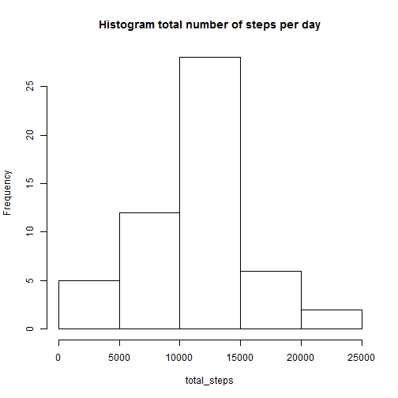
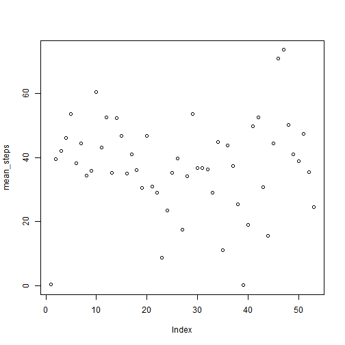
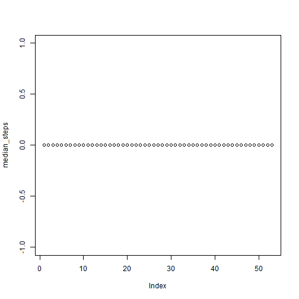
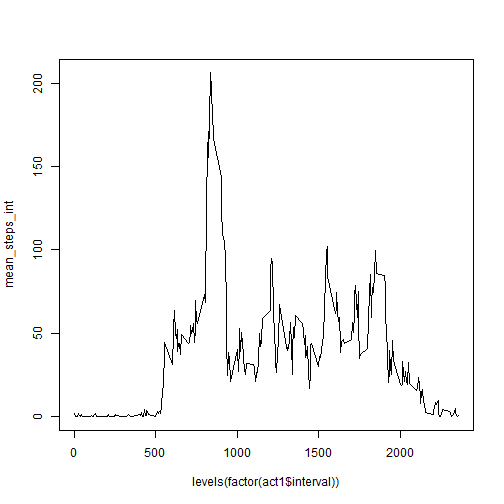
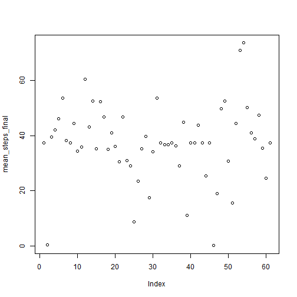
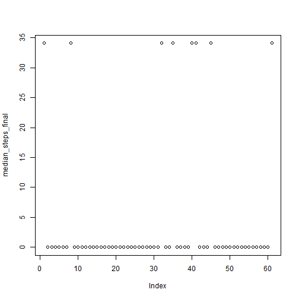
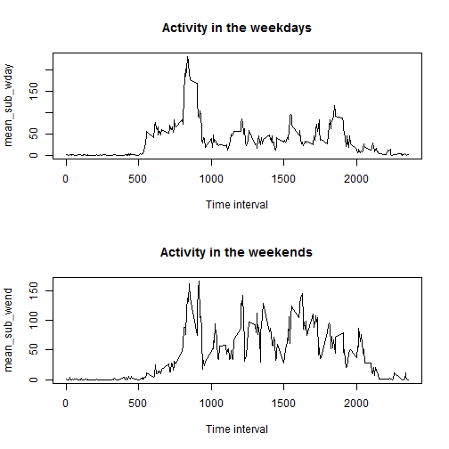

# Reproducible Research: Peer Assessment 1


================================================


## Loading and preprocessing the data


We assume that the activity.csv file has already been unzipped in the workdirectory.Lets check what is the number of rows with completed obseravtions.


```r
setwd("C:/Users/x/RepData_PeerAssessment1")
act<-read.csv("activity.csv")
head(act)
```

  steps       date interval
1    NA 2012-10-01        0
2    NA 2012-10-01        5
3    NA 2012-10-01       10
4    NA 2012-10-01       15
5    NA 2012-10-01       20
6    NA 2012-10-01       25

```r
dim (act)
```

[1] 17568     3

```r
cc<-complete.cases(act)
sum(cc) #This is the number of complete observations
```

[1] 15264

```r
act1<-act[cc,] #This is a subset with completed observations only
dim (act1)
```

[1] 15264     3


## What is mean total number of steps taken per day?


```r
days<-as.Date(act1$date)
total_steps<-tapply(act1$steps,days,sum, na.rm=TRUE)
length(total_steps)
```

[1] 53

```r
hist(total_steps, main="Histogram total number of steps per day")
```

 

```r
mean_steps<-tapply(act1$steps, days, mean, na.rm=TRUE) #This is the mean number of steps per day
mean_steps
```

2012-10-02 2012-10-03 2012-10-04 2012-10-05 2012-10-06 2012-10-07 
    0.4375    39.4167    42.0694    46.1597    53.5417    38.2465 
2012-10-09 2012-10-10 2012-10-11 2012-10-12 2012-10-13 2012-10-14 
   44.4826    34.3750    35.7778    60.3542    43.1458    52.4236 
2012-10-15 2012-10-16 2012-10-17 2012-10-18 2012-10-19 2012-10-20 
   35.2049    52.3750    46.7083    34.9167    41.0729    36.0938 
2012-10-21 2012-10-22 2012-10-23 2012-10-24 2012-10-25 2012-10-26 
   30.6285    46.7361    30.9653    29.0104     8.6528    23.5347 
2012-10-27 2012-10-28 2012-10-29 2012-10-30 2012-10-31 2012-11-02 
   35.1354    39.7847    17.4236    34.0938    53.5208    36.8056 
2012-11-03 2012-11-05 2012-11-06 2012-11-07 2012-11-08 2012-11-11 
   36.7049    36.2465    28.9375    44.7326    11.1771    43.7778 
2012-11-12 2012-11-13 2012-11-15 2012-11-16 2012-11-17 2012-11-18 
   37.3785    25.4722     0.1424    18.8924    49.7882    52.4653 
2012-11-19 2012-11-20 2012-11-21 2012-11-22 2012-11-23 2012-11-24 
   30.6979    15.5278    44.3993    70.9271    73.5903    50.2708 
2012-11-25 2012-11-26 2012-11-27 2012-11-28 2012-11-29 
   41.0903    38.7569    47.3819    35.3576    24.4688 

```r
plot(mean_steps)
```

 

```r
median_steps<-tapply(act1$steps, days, median, na.rm=TRUE) #This is the median number of steps per day
median_steps
```

2012-10-02 2012-10-03 2012-10-04 2012-10-05 2012-10-06 2012-10-07 
         0          0          0          0          0          0 
2012-10-09 2012-10-10 2012-10-11 2012-10-12 2012-10-13 2012-10-14 
         0          0          0          0          0          0 
2012-10-15 2012-10-16 2012-10-17 2012-10-18 2012-10-19 2012-10-20 
         0          0          0          0          0          0 
2012-10-21 2012-10-22 2012-10-23 2012-10-24 2012-10-25 2012-10-26 
         0          0          0          0          0          0 
2012-10-27 2012-10-28 2012-10-29 2012-10-30 2012-10-31 2012-11-02 
         0          0          0          0          0          0 
2012-11-03 2012-11-05 2012-11-06 2012-11-07 2012-11-08 2012-11-11 
         0          0          0          0          0          0 
2012-11-12 2012-11-13 2012-11-15 2012-11-16 2012-11-17 2012-11-18 
         0          0          0          0          0          0 
2012-11-19 2012-11-20 2012-11-21 2012-11-22 2012-11-23 2012-11-24 
         0          0          0          0          0          0 
2012-11-25 2012-11-26 2012-11-27 2012-11-28 2012-11-29 
         0          0          0          0          0 

```r
plot(median_steps)
```

 

## What is the average daily activity pattern?


```r
mean_steps_int<-tapply(act1$steps,act1$interval,mean,na.rm=TRUE)
length(mean_steps_int)
```

[1] 288

```r
plot(mean_steps_int~levels(factor(act1$interval)), type="l")
```

 

```r
grep(max(mean_steps_int), mean_steps_int)
```

[1] 104

```r
levels(factor(act1$interval))[[104]]#This is the time interval with maximal activity
```

[1] "835"

## Imputing missing values


```r
means_int<-tapply(act$steps, act$interval, mean, na.rm=TRUE)
length(means_int)
```

[1] 288

```r
ndays<-nrow(act)/length(means_int)
seq<-rep(means_int, times=ndays)
act_imput<-cbind(act,seq)
fac<-is.na(act$steps)
sub1<-act_imput[fac,]
sub2<-act_imput[!fac,]
sub1[,1]<-sub1[,4]
act_final<-rbind(sub1,sub2)
table(is.na(act_final))
```


FALSE 
70272 

```r
act_final<-act_final[,1:3]
days1<-as.Date(act_final$date)
head(act_final)
```

    steps       date interval
1 1.71698 2012-10-01        0
2 0.33962 2012-10-01        5
3 0.13208 2012-10-01       10
4 0.15094 2012-10-01       15
5 0.07547 2012-10-01       20
6 2.09434 2012-10-01       25

```r
length(table(days1))## Obviously we have 8 more days with complete data.
```

[1] 61

```r
mean_steps_final<-tapply(act_final$steps, days1, mean)
mean_steps_final #Means did not change because measurements for entire day were excluded
```

2012-10-01 2012-10-02 2012-10-03 2012-10-04 2012-10-05 2012-10-06 
   37.3826     0.4375    39.4167    42.0694    46.1597    53.5417 
2012-10-07 2012-10-08 2012-10-09 2012-10-10 2012-10-11 2012-10-12 
   38.2465    37.3826    44.4826    34.3750    35.7778    60.3542 
2012-10-13 2012-10-14 2012-10-15 2012-10-16 2012-10-17 2012-10-18 
   43.1458    52.4236    35.2049    52.3750    46.7083    34.9167 
2012-10-19 2012-10-20 2012-10-21 2012-10-22 2012-10-23 2012-10-24 
   41.0729    36.0938    30.6285    46.7361    30.9653    29.0104 
2012-10-25 2012-10-26 2012-10-27 2012-10-28 2012-10-29 2012-10-30 
    8.6528    23.5347    35.1354    39.7847    17.4236    34.0938 
2012-10-31 2012-11-01 2012-11-02 2012-11-03 2012-11-04 2012-11-05 
   53.5208    37.3826    36.8056    36.7049    37.3826    36.2465 
2012-11-06 2012-11-07 2012-11-08 2012-11-09 2012-11-10 2012-11-11 
   28.9375    44.7326    11.1771    37.3826    37.3826    43.7778 
2012-11-12 2012-11-13 2012-11-14 2012-11-15 2012-11-16 2012-11-17 
   37.3785    25.4722    37.3826     0.1424    18.8924    49.7882 
2012-11-18 2012-11-19 2012-11-20 2012-11-21 2012-11-22 2012-11-23 
   52.4653    30.6979    15.5278    44.3993    70.9271    73.5903 
2012-11-24 2012-11-25 2012-11-26 2012-11-27 2012-11-28 2012-11-29 
   50.2708    41.0903    38.7569    47.3819    35.3576    24.4688 
2012-11-30 
   37.3826 

```r
plot(mean_steps_final)
```

 

```r
median_steps_final<-tapply(act_final$steps, days1, median)
median_steps_final #Medians for the days with missing values differed from 0 because the substitution was made with means
```

2012-10-01 2012-10-02 2012-10-03 2012-10-04 2012-10-05 2012-10-06 
     34.11       0.00       0.00       0.00       0.00       0.00 
2012-10-07 2012-10-08 2012-10-09 2012-10-10 2012-10-11 2012-10-12 
      0.00      34.11       0.00       0.00       0.00       0.00 
2012-10-13 2012-10-14 2012-10-15 2012-10-16 2012-10-17 2012-10-18 
      0.00       0.00       0.00       0.00       0.00       0.00 
2012-10-19 2012-10-20 2012-10-21 2012-10-22 2012-10-23 2012-10-24 
      0.00       0.00       0.00       0.00       0.00       0.00 
2012-10-25 2012-10-26 2012-10-27 2012-10-28 2012-10-29 2012-10-30 
      0.00       0.00       0.00       0.00       0.00       0.00 
2012-10-31 2012-11-01 2012-11-02 2012-11-03 2012-11-04 2012-11-05 
      0.00      34.11       0.00       0.00      34.11       0.00 
2012-11-06 2012-11-07 2012-11-08 2012-11-09 2012-11-10 2012-11-11 
      0.00       0.00       0.00      34.11      34.11       0.00 
2012-11-12 2012-11-13 2012-11-14 2012-11-15 2012-11-16 2012-11-17 
      0.00       0.00      34.11       0.00       0.00       0.00 
2012-11-18 2012-11-19 2012-11-20 2012-11-21 2012-11-22 2012-11-23 
      0.00       0.00       0.00       0.00       0.00       0.00 
2012-11-24 2012-11-25 2012-11-26 2012-11-27 2012-11-28 2012-11-29 
      0.00       0.00       0.00       0.00       0.00       0.00 
2012-11-30 
     34.11 

```r
plot(median_steps_final)
```

 


## Are there differences in activity patterns between weekdays and weekends?


```r
days2<-as.POSIXlt(days1)
class(days2)
```

[1] "POSIXlt" "POSIXt" 

```r
days3<-days2$wday
fdays<-factor(days3)
act_final$fdays<-fdays
colnames(act_final)
```

[1] "steps"    "date"     "interval" "fdays"   

```r
sub_wend<-subset(act_final, subset=(act_final$fdays%in%c(0,6)))
sub_wday<-subset(act_final, subset=(act_final$fdays%in%c(1:5)))
dim(sub_wend)
```

[1] 4608    4

```r
dim(sub_wday)
```

[1] 12960     4

```r
mean_sub_wday<-tapply(sub_wday$steps,sub_wday$interval,mean)
mean_sub_wend<-tapply(sub_wend$steps,sub_wend$interval,mean)
par(mfrow=c(2,1))
plot(mean_sub_wday~levels(factor(sub_wday$interval)), type="l", main="Activity in the weekdays", xlab="Time interval")
plot(mean_sub_wend~levels(factor(sub_wend$interval)), type="l", main="Activity in the weekends", xlab="Time interval")
```

 

That is the end.
